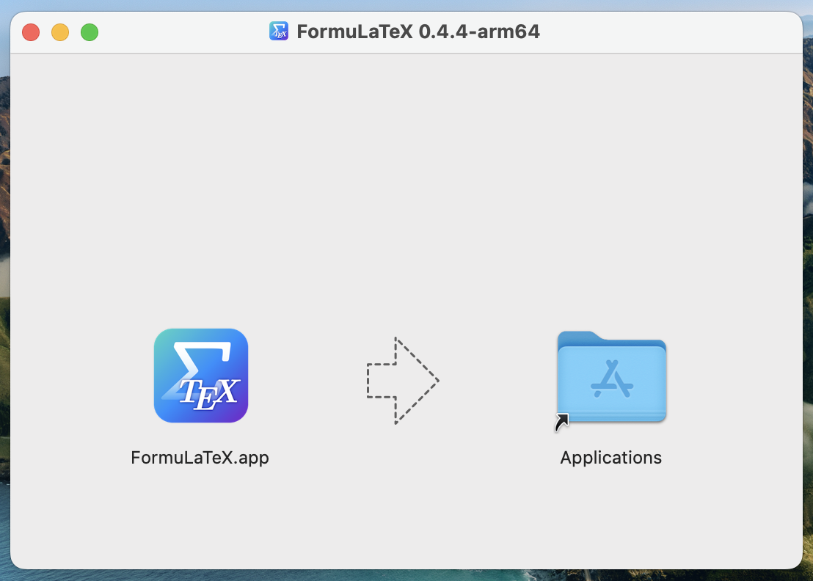
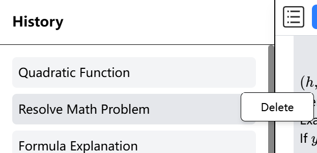

# FormuLaTeX: User Manual

FormuLaTeX is a cross-platform Electron App that provides the following features:

- Precise conversion from image/handwritten formulas to LaTeX.
- Easy management for formulas.
- Integration of the AI service, supporting natural language generation of formulas, inter-pretation of formulas and mathematical dialogues.
- Multi-language support (English and Simplified Chinese).
- Extensive mathematical notation with user-friendly formula adjustments.
- Supports Windows/Linux/macOS platforms.

## Contents

1. [Installation](#1-installation)
   1. [Download the Latest Release](#download-the-latest-release)
   2. [Install on Different Platforms](#install-on-different-platforms)
      1. [Windows (Installer)](#windows-installer)
      2. [Windows (Portable)](#windows-portable)
      3. [macOS (Installer)](#macos-installer)
      4. [macOS (Portable)](#macos-portable)
      5. [Linux (deb)](#linux-deb)
      6. [Linux (App Image)](#linux-app-image)
2. [Usage](#2-usage)
   1. [Initial Setup](#initial-setup)
   2. [Formula Edit](#formula-edit)
   3. [Formula Recognition](#formula-recognition)
   4. [Quick Input Area](#quick-input-area)
   5. [Ask AI](#ask-ai)
   6. [Chat History](#chat-history)
   7. [Settings](#settings)
   8. [Error](#error)

## 1. Installation

### Download the Latest Release

Please visit the [Releases Page](https://github.com/Leo204-LKY/FormuLaTeX/releases) on GitHub and find the latest release.


Depending on your system, click on the file in the Assets area to download the app.

- Linux (deb): `FormuLaTeX-x.x.x-linux-amd64.deb`
- Linux (App Image): `FormuLaTeX-x.x.x-linux-x86_64.AppImage`
- macOS (Installer): `FormuLaTeX-x.x.x-mac-arm64.dmg`
- macOS (Portable): `FormuLaTeX-x.x.x-mac-arm64.zip`
- Windows (Installer): `FormuLaTeX-x.x.x-win-x64.exe`
- Windows (Portable): `FormuLaTeX-x.x.x-win-x64.zip`

Note that Linux packages are only supported on x86 systems, and all packages are supported on 64-bit operating systems only. Once the download is complete, the file can be verified by reference to SHA256.

### Install on Different Platforms

Before the installation, please check the following:

- Since we are not in a position to sign the App, there are additional steps in the installation process.
- We recommend running the app under the latest system (Windows 11, macOS Sequoia), older OSes may work but have not been tested.

#### Windows (Installer)

Run the downloaded `FormuLaTeX-x.x.x-win-x64.exe`, the installer will automatically complete the installation and start the App.

If the Windows Defender SmartScreen window appears, click `More info` and then `Run Anaway` to run the installer.

  
_Image from [GIG PERFORMER](https://gigperformer.com/docs/ultimate-guide-to-optimize-windows-for-stage/microsoftdefendersmartscreen.html)_

#### Windows (Portable)

Unzip `FormuLaTeX-x.x.x-win-x64.zip` and run `FormuLaTeX.exe` to open the App.

If the Windows Defender SmartScreen window appears, click `More info` and then `Run Anaway` to open the app.

  
_Image from [GIG PERFORMER](https://gigperformer.com/docs/ultimate-guide-to-optimize-windows-for-stage/microsoftdefendersmartscreen.html)_

#### macOS (Installer)

1. Open `FormuLaTeX-x.x.x-mac-arm64.dmg` and drag and drop the app into the Applications folder.

   

   If you are updating the app, click `Replace` when you encounter the following pop-up window.

   

2. Open Terminal and run the following command ([Why?](#why-terminal-macos)):

   ```shell
   sudo xattr -rd com.apple.quarantine /Applications/FormuLaTeX.app
   ```

3. Run the app normally.

#### macOS (Portable)

1. Unzip `FormuLaTeX-x.x.x-mac-arm64.zip`

2. Make a note of the path to `FormuLaTeX.app`, then open Terminal and run the following command ([Why?](#why-terminal-macos)):

   ```shell
   sudo xattr -rd com.apple.quarantine <Path to FormuLaTeX.app>
   ```

3. Run the app normally.

> <a id="why-terminal-macos"></a> **Why Need to Run Command in macOS Terminal**  
> For security reasons, macOS does not allow you to run unsigned apps directly (you'll get the following popup), so you need to run a command in Terminal to remove Gatekeeper's “quarantine attribute”.  
> _See [this Issue](https://github.com/Leo204-LKY/FormuLaTeX/issues/48) for more detail._  
> 

#### Linux (deb)

In most cases, you can double-click `FormuLaTeX-x.x.x-linux-amd64.deb` to complete the installation.

Alternatively, you can use dpkg or apt in the terminal to install the app.

```shell
sudo dpkg -i FormuLaTeX-<version>-linux-amd64.deb
# OR
sudo apt install ./FormuLaTeX-<version>-linux-amd64.deb
```

Once you've completed the installation, depending on the desktop environment you're using, you can usually find and run the app in the Applications list (in the case of Ubuntu/GNOME, click on the nine-panel chart in the lower left corner).

#### Linux (App Image)

Once you have downloaded the `FormuLaTeX-x.x.x-linux-x86_64.AppImage
` file, you will first need to make it executable.

```shell
chmod +x FormuLaTeX-<version>-linux-x86_64.AppImage
```

Then you can double-click the file to run the app.

## 2. Usage

#### Initial Setup

When you start FormuLaTeX for the first time, you will see a Welcome page, and FormuLaTeX will ask you to complete the initial setup:

- Language
- API config, this includes:
  - DeepSeek API Key
  - SimpleTex App ID
  - SimpleTex App Secret

You can also click `Skip for now` button and complete the setup in the settings menu later.


After completing the setup, you can choose to take a User Tour to help get started with the App faster!


The following figure shows the main interface of FormuLaTeX, and the functions of each section are described in detail below.


#### Formula Edit

The area located on the right side of the page and occupying more space is the formula editing area.


With the shortcut menu at the top of the editing area, you can easily modify the formatting and fonts of formulas, as well as undo, redo, and more!


Frequently used symbols and expressions are provided at the top of the page and can be quickly entered with a single click.


#### Formula Recognition

Click the `Upload Image` button at the bottom of the edit area to use the SimpleTex API to recognize formulas in images (including printed and handwritten formulas, also supporting physics and chemistry formulas).


Click the input area to select the picture, or directly drag and drop the picture into the input area to automatically recognize the formula.


After completing the formula input or recognition, click the `Ask AI` button at the bottom of the input box to ask DeepSeek about the exact meaning of the formula, the solution to the mathematical expression, and so on.

#### Quick Input Area

On the left side of the page is the Quick Input area, where you can save and manage the recognized formulas for future use.


Select a tag and click the blue New Formula button to add a formula to Quick Input, and adjust the name and content of the formula before adding it.


Click on one of the formulas to quickly insert it into the input area, including the formula editing area and the message box for AI chat.

Right-click on any formula to edit or delete it.


#### Ask AI

Click the `Ask AI` button in the input area, or the blue arrow in the center of the far right side of the page, to expand the AI dialog screen.

If you enter the dialog via the `Ask AI` button, the formula is automatically inserted into the dialog and can be asked by simply clicking the Send button. You can also click on a formula in the Quick Input area to quickly insert its LaTeX form into the input box.


DeepSeek gives detailed explanations of formulas based on the language preferred by the user interface, or the language used by you when asking.

Once you've completed your answer, you can also ask the AI a follow-up question via the message box.


Click the title at the top to customize the conversation title.

Click the blue New Chat to create a new conversation.


#### Chat History

All conversations are stored in the history at the top left corner of the conversation page, which can be expanded by clicking on it.


Right click on any dialog to delete it.



#### Settings

Click on the Settings button to the right of the title area to expand the settings.

The settings provide shortcuts such as Restart User Tour, Open GitHub Repository, Open User Manual and Bug Report and Feedback.

It is also possible to adjust the language and DeepSeek or SimpleTex API configuration.

Currently supported languages include English, Chinese, Japanese, etc.

At the bottom of the Settings page, there is App version information, translators, etc.


The DeepSeek and SimpleTex APIs will no longer be visible once they are set, and if they need to be changed, the input box will be cleared and you will be asked to re-enter the API configuration.

The settings page will not close if edits are not completed or canceled.


#### Error

If an error occurs in FormuLaTeX, a pop-up window will alert you. Please feel free to give us feedback on the problem so that we can better optimize FormuLaTeX!


